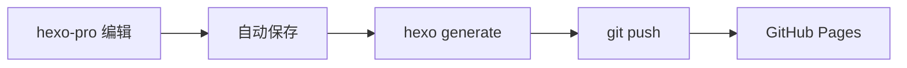

# 博客技术架构介绍

本站基于 **Hexo** 静态博客框架构建，使用 **NexT v8** 主题，通过 **hexo-pro** 实现后台管理。这篇文章记录博客的整体架构和核心功能。

## 技术栈

| 组件 | 技术选型 |
|------|---------|
| 博客框架 | Hexo 8.1.2 |
| 主题 | NexT v8.29 |
| 后台管理 | hexo-pro 2.0.0 |
| 部署 | GitHub Pages |
| 音乐播放器 | 自写无依赖 |

## 项目结构

```
blog-hexo/
├── _config.yml              # Hexo 站点配置
├── _config.next.yml         # NexT 主题配置
├── source/
│   ├── _posts/              # 文章 Markdown
│   ├── music/               # 音乐文件（MP3 + 封面）
│   ├── css/sidebar-music.css # 播放器样式
│   ├── js/sidebar-music.js  # 播放器逻辑
│   └── images/              # 图片资源
├── scripts/
│   ├── sidebar-music.js     # 播放器注入 + Range 中间件
│   └── patch-hexo-pro.js    # hexo-pro 兼容性修复
├── hexo-pro-custom/         # hexo-pro 自定义文件
│   ├── index.html           # 带音乐管理入口的主页
│   ├── music-inject.js      # 侧边栏菜单注入
│   ├── music.html           # 音乐管理页面
│   └── music_api.js         # 音乐 API 接口
└── public/                  # 生成的静态文件
```

## hexo-pro 后台管理

通过 `hexo-pro` 实现博客的可视化管理，支持文章编辑、图床、部署、音乐管理等功能。

### 访问方式

本地启动后访问 `http://localhost:4000/hexo-blog/pro/`，首次使用需注册管理员账号。

### 主要功能

- **仪表盘**：文章统计、分类标签、系统信息
- **内容管理**：文章/页面的增删改查、草稿箱、回收站
- **图床**：图片上传、管理、引用
- **YAML 配置**：在线编辑主题和站点配置
- **音乐管理**：上传/编辑/删除歌曲，支持本地文件和外部链接
- **部署**：一键推送到 GitHub Pages

### 已修复的兼容性问题

hexo-pro 原生不支持自定义 root 路径（如 `/hexo-blog/`），通过 `patch-hexo-pro.js` 修复：

1. **路由重写**：`/hexopro/api/*` → `/hexo-blog/hexopro/api/*`
2. **body-parser**：添加 root 前缀的请求体解析
3. **SPA 路由**：index.js 的路径检测适配 root
4. **静态资源**：index.html 的资源路径改为相对路径
5. **React Router basename**：动态计算而非硬编码

## 自写音乐播放器

本站最大的自定义功能是**从零手写的侧边音乐播放器**，无任何外部依赖。

### 核心特性

- **播放控制**：上一曲/下一曲/播放暂停/模式切换
- **播放模式**：列表循环 → 随机播放 → 单曲循环
- **封面动画**：播放时圆形旋转，切歌时淡入淡出
- **进度条**：支持点击跳转和拖拽快进
- **歌曲列表**：点击直接播放，当前播放高亮

### 音乐管理（hexo-pro 集成）

在 hexo-pro 后台侧边栏添加了「音乐管理」入口，支持：

- 上传本地 MP3 文件
- 添加外部音乐链接（如网易云音乐）
- 编辑歌曲信息（标题、歌手、封面）
- 删除歌曲
- 内嵌播放器预览

歌曲数据同步到 `source/js/sidebar-music.js`，博客侧边栏实时显示最新歌曲。

### 实现原理

播放器通过 Hexo 的 `theme_inject` 机制注入到 NexT 侧边栏，API 中间件处理 `.mp3` 文件的 Range 请求（支持 206 Partial Content），确保进度条和时长正常工作。

```js
// scripts/sidebar-music.js - 注入播放器
hexo.extend.filter.register('theme_inject', (injects) => {
  injects.sidebar.raw('sidebar-music', `
    <div class="sidebar-music">
      <div class="sidebar-music-title">音乐电台</div>
      <div id="sidebar-music-player"></div>
    </div>
  `);
});
```

## 主题定制

### 封面旋转动画

播放时封面变圆形并旋转，切歌时淡入淡出过渡：

```css
.sm-cover.playing {
  border-radius: 50%;
  animation: sm-rotate 12s linear infinite;
}

.sm-cover.switching {
  opacity: 0;
  transform: scale(0.8);
}
```

### 快捷导航按钮

右下角浮动按钮，支持返回顶部和返回上页，带 tooltip 提示。

### 搜索弹窗

添加了搜索图标文字提示，优化搜索体验。

## 部署流程



1. 在 hexo-pro 后台编辑文章
2. 保存后自动触发 `hexo.generate()` 重新生成
3. 通过 hexo-pro 部署功能推送到 GitHub
4. 几分钟后在 `https://2iker.github.io/hexo-blog/` 查看

## 总结

这套架构的优点是**零数据库依赖、内容即文件、可视化管理**。通过 hexo-pro 和自定义脚本，实现了完整的博客管理体验，包括文章编辑、音乐管理、一键部署。

如果你也在搭建博客，欢迎参考本站的配置和源码。
