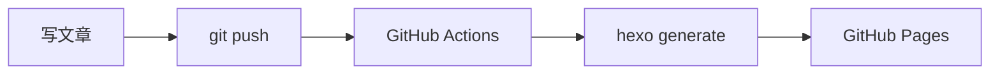

# 博客技术架构介绍

本站基于 **Hexo** 静态博客框架构建，使用 **NexT v8** 主题。这篇文章记录博客的架构设计、主题定制和自写音乐播放器的实现过程。

## 技术栈

| 组件 | 技术选型 |
|------|---------|
| 博客框架 | Hexo 8 |
| 主题 | NexT v8.29 |
| 部署 | GitHub Pages + GitHub Actions |
| 后台管理 | hexo-admin |

## 项目结构

```
blog-hexo/
├── _config.yml           # Hexo 站点配置
├── _config.next.yml      # NexT 主题配置
├── source/
│   ├── _posts/           # 文章 Markdown 文件
│   ├── music/            # 音乐文件
│   ├── css/              # 自定义样式
│   ├── js/               # 自定义脚本
│   └── images/           # 图片资源
├── scripts/
│   ├── sidebar-music.js  # 播放器注入 + API 中间件
│   └── patch-hexo-admin.js # hexo-admin 兼容性修复
└── public/               # 生成的静态文件（部署用）
```

## 自写音乐播放器

本站最大的自定义功能是**从零手写的侧边音乐播放器**，无任何外部依赖。

### 核心特性

- **播放控制**：上一曲/下一曲/播放暂停/shuffle 模式切换
- **播放模式**：列表循环 → 随机播放 → 单曲循环，按按钮循环切换
- **列表管理**：点击展开/收起歌曲列表，当前播放高亮
- **封面交互**：点击封面 = 播放/暂停
- **无白圈**：清除所有焦点样式（outline + box-shadow）
- **布局居中**：标题/封面/歌名/作者/时间/进度条/按钮全部居中

### 实现方式

播放器通过 Hexo 的 `theme_inject` 机制注入到 NexT 侧边栏，API 中间件处理 `.mp3` 文件的 Range 请求（支持 206 Partial Content），确保进度条和时长正常工作。

```js
// scripts/sidebar-music.js - 注入播放器 HTML
hexo.extend.filter.register('theme_inject', function (data) {
  data.sidebar = data.sidebar || [];
  data.sidebar.push({
    type: 'sidebar',
    content: '<div class="sidebar-player">...</div>'
  });
});
```

## 主题定制

### 标签页颜色修复

NexT 默认的标签云颜色对比度不足，通过自定义样式修复：

```stylus
// source/_data/styles.styl
.tag-cloud a
  color: var(--link-color)
  &:hover
    color: var(--link-hover-color)
    text-decoration: underline
```

### 搜索弹窗

添加了搜索图标文字提示，优化搜索体验。

### 快捷导航按钮

右下角浮动按钮，支持返回顶部和返回上页，带 tooltip 提示和下拉延迟动画。

## 后台管理（hexo-admin）

通过 `hexo-admin` 插件实现文章的可视化管理。

### 已修复的兼容性问题

1. **api.js `next` 参数传递**：中间件包装器漏传 `next`，导致编辑操作返回 500
2. **hexo-front-matter `util.isDate`**：Node 20+ 移除了 `util.isDate`，写入文件时崩溃

修复脚本 `scripts/patch-hexo-admin.js` 会在 `npm install` 后自动应用。

### 使用方式

```bash
# 启动本地服务器
npm run server

# 访问后台管理
# http://localhost:4000/hexo-blog/admin/
```

编辑文章后提交推送到 GitHub，Actions 自动部署到 Pages。

## 部署流程



1. 在 `source/_posts/` 创建或编辑 Markdown 文件
2. 推送到 `main` 分支
3. GitHub Actions 自动执行 `hexo generate` + 部署
4. 几分钟后在 `https://2iker.github.io/hexo-blog/` 查看

## 总结

这套架构的优点是**零数据库依赖、内容即文件、易于迁移和备份**。通过自定义脚本和样式，可以在保持 Hexo 生态的同时实现高度个性化。

如果你也在搭建博客，欢迎参考本站的配置和源码。
